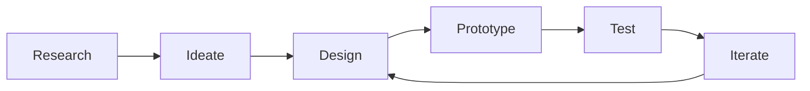

# Hi 👋, I'm Tanuja Chaudhari
### 🎨 Passionate UI/UX Designer & Digital Experience Architect

<p align="center">
  
  
  
</p>

---

## 🚀 About Me

I'm a dedicated UI/UX Designer who believes in creating meaningful digital experiences that solve real problems. My approach combines user-centered design principles with modern aesthetics to craft interfaces that are both beautiful and functional.

- 🎯 **Currently working on:** Innovative mobile app designs and web experiences
- 🌱 **Learning:** Advanced prototyping techniques and design systems
- 🤝 **Open to collaborate on:** UI/UX projects, design systems, and user research
- 💬 **Ask me about:** User experience design, interface design, and design thinking
- ⚡ **Fun fact:** I love turning complex problems into simple, elegant solutions

---

## 🛠️ Design Arsenal

### 🎨 Design Tools
<p align="left">
  
  
  
  
</p>

### 💻 Development Skills
<p align="left">
  
  
  
  
  
</p>

### 🔧 Other Tools
<p align="left">
  
  
  
  
</p>

---

## 🎯 Design Expertise

```
🔹 User Experience (UX) Design    🔹 User Interface (UI) Design
🔹 Wireframing & Prototyping     🔹 Design Systems
🔹 User Research & Testing       🔹 Information Architecture
🔹 Responsive Web Design         🔹 Mobile App Design
🔹 Interaction Design            🔹 Visual Design
```

---

## 📊 Design Process



**My approach:** Research-driven design → User-centered solutions → Iterative improvement

---

## 🏆 Achievements

<p align="left">
  
</p>

---

## 📈 GitHub Activity

<div align="center">
  
  
</div>

<div align="center">
  
</div>

---

## 🎨 Featured Projects

### 📱 Mobile Banking App Redesign
- **Challenge:** Improving user experience for complex financial transactions
- **Solution:** Streamlined navigation and intuitive visual hierarchy
- **Tools:** Figma, Principle, After Effects

### 🛒 E-commerce Platform UI
- **Challenge:** Increasing conversion rates through design
- **Solution:** User-focused checkout process and product discovery
- **Tools:** Adobe XD, Sketch, InVision

### 🎯 SaaS Dashboard Design
- **Challenge:** Making complex data accessible and actionable
- **Solution:** Clean interface with smart data visualization
- **Tools:** Figma, Chart.js, React

---

## 🤝 Let's Connect!

<p align="center">
  <a href="https://linkedin.com/in/yourprofile"></a>
  <a href="https://behance.net/yourprofile"></a>
  <a href="https://dribbble.com/yourprofile"></a>
  <a href="mailto:your.email@gmail.com"></a>
</p>

---

<div align="center">
  <h3>💡 "Design is not just what it looks like and feels like. Design is how it works." - Steve Jobs</h3>
  
  **Thanks for visiting! Let's create something amazing together! ✨**
</div>
