```mermaid
graph LR
    A[🔍 Research] --> B[💡 Ideate]
    B --> C[🎨 Design]
    C --> D[⚡ Prototype]
    D --> E[🧪 Test]
    E --> F[🔄 Iterate]
    F --> C
    style A fill:#ff6b6b
    style B fill:#4ecdc4  
    style C fill:#45b7d1
    style D fill:#96ceb4
    style E fill:#ffeaa7
    style F fill:#dda0dd
```
  

  

  
  
  

##  &nbsp;About Me

I'm a dedicated UI/UX Designer who believes in creating meaningful digital experiences that solve real problems. My approach combines user-centered design principles with modern aesthetics to craft interfaces that are both beautiful and functional.

- 🎯 **Currently working on:** Innovative mobile app designs and web experiences
- 🌱 **Learning:** Advanced prototyping techniques and design systems  
- 🤝 **Open to collaborate on:** UI/UX projects, design systems, and user research
- 💬 **Ask me about:** User experience design, interface design, and design thinking
- ⚡ **Fun fact:** I love turning complex problems into simple, elegant solutions

---

## &nbsp;&nbsp;Design Arsenal

### 🎨 Design Tools

  
    
  
  

  

### 💻 Development Skills

  
  
  
  
  

  

### 🔧 Other Tools

  
  
  

  

##  &nbsp;Design Expertise

| 🎨 **UI/UX Design** | 🔍 **Research & Analysis** | 🛠️ **Technical Skills** |
|:---:|:---:|:---:|
| User Interface Design | User Research & Testing | Responsive Web Design |
| User Experience Design | Information Architecture | Mobile App Design |
| Wireframing & Prototyping | Usability Analysis | Interaction Design |
| Design Systems | Competitive Analysis | Visual Design |

##  &nbsp;Design Process

  

  

---

##  &nbsp;Achievements

  

  

##  &nbsp;GitHub Activity

  

  
  

  

  

##  &nbsp;Featured Projects

  

### 📱 Mobile Banking App Redesign

**Challenge:** Improving user experience for complex financial transactions  
**Solution:** Streamlined navigation and intuitive visual hierarchy  
**Tools:** Figma, Principle, After Effects  

---

### 🛒 E-commerce Platform UI

**Challenge:** Increasing conversion rates through design  
**Solution:** User-focused checkout process and product discovery  
**Tools:** Adobe XD, Sketch, InVision  

---

### 🎯 SaaS Dashboard Design

**Challenge:** Making complex data accessible and actionable  
**Solution:** Clean interface with smart data visualization  
**Tools:** Figma, Chart.js, React  

##  &nbsp;Let's Connect!

  

  
  
  
  

  

  

  

