```mermaid
graph LR
    A[🔍 Research] --> B[💡 Ideate]
    B --> C[🎨 Design]
    C --> D[⚡ Prototype]
    D --> E[🧪 Test]
    E --> F[🔄 Iterate]
    F --> C
    style A fill:#0e75b6
    style B fill:#4ecdc4  
    style C fill:#45b7d1
    style D fill:#96ceb4
    style E fill:#ffeaa7
    style F fill:#dda0dd
```
  

  

  
  
  

##  &nbsp;About Me

I'm a passionate **UI/UX Designer** dedicated to crafting meaningful digital experiences that bridge the gap between user needs and business goals. My journey combines creative design thinking with technical implementation skills.

- 🌱 **Currently learning:** Advanced UI/UX Design principles and methodologies
- 🎯 **Focus areas:** User-centered design, prototyping, and design systems
- 🤝 **Open to collaborate on:** Design projects, user research, and creative solutions
- 📫 **Reach me at:** [tnchaudhari4440@gmail.com](mailto:tnchaudhari4440@gmail.com)
- 💡 **Philosophy:** Design is not just how it looks, but how it works
- ⚡ **Fun fact:** I love transforming complex problems into simple, elegant solutions

## &nbsp;&nbsp;Skills & Tools

### 🎨 Design & Creative Tools

  
    
  

  
  

### 💻 Frontend Development

  
  
  
  

  
  
  
  
  

### 📱 Mobile & Cross-Platform

  

  
  

### 🛠️ Development & Data Tools

  
  

  
  
  
  

  
  
  
  

### 🔧 Programming Languages & Cloud

  
  
  
  

##  &nbsp;Design Expertise

| 🎨 **Design Skills** | 💡 **Creative Process** | 🔍 **Research & Analysis** |
|:---:|:---:|:---:|
| User Interface Design | Ideation & Brainstorming | User Research |
| User Experience Design | Wireframing | Usability Testing |
| Prototyping | Visual Design | Competitor Analysis |
| Design Systems | Interaction Design | User Journey Mapping |

##  &nbsp;Design Process

  

  

##  &nbsp;Achievements & Recognition

  

  

##  &nbsp;GitHub Analytics

  

  
  

  

  

##  &nbsp;Featured Work

  

### 🎨 UI/UX Design Projects

**Focus:** Creating intuitive and engaging user experiences  
**Skills:** User research, wireframing, prototyping, visual design  
**Tools:** Figma, design thinking methodologies  

---

### 💻 Frontend Development

**Focus:** Bringing designs to life with clean, responsive code  
**Skills:** HTML5, CSS3, JavaScript, React, Flutter  
**Tools:** Modern development frameworks and libraries  

---

### 📊 Data Visualization

**Focus:** Making complex data accessible and actionable  
**Skills:** Chart.js, data analysis, information architecture  
**Tools:** Python, Pandas, various charting libraries  

##  &nbsp;Let's Connect & Collaborate!

  

  

  
  
  
  

  

  

  

---

  

